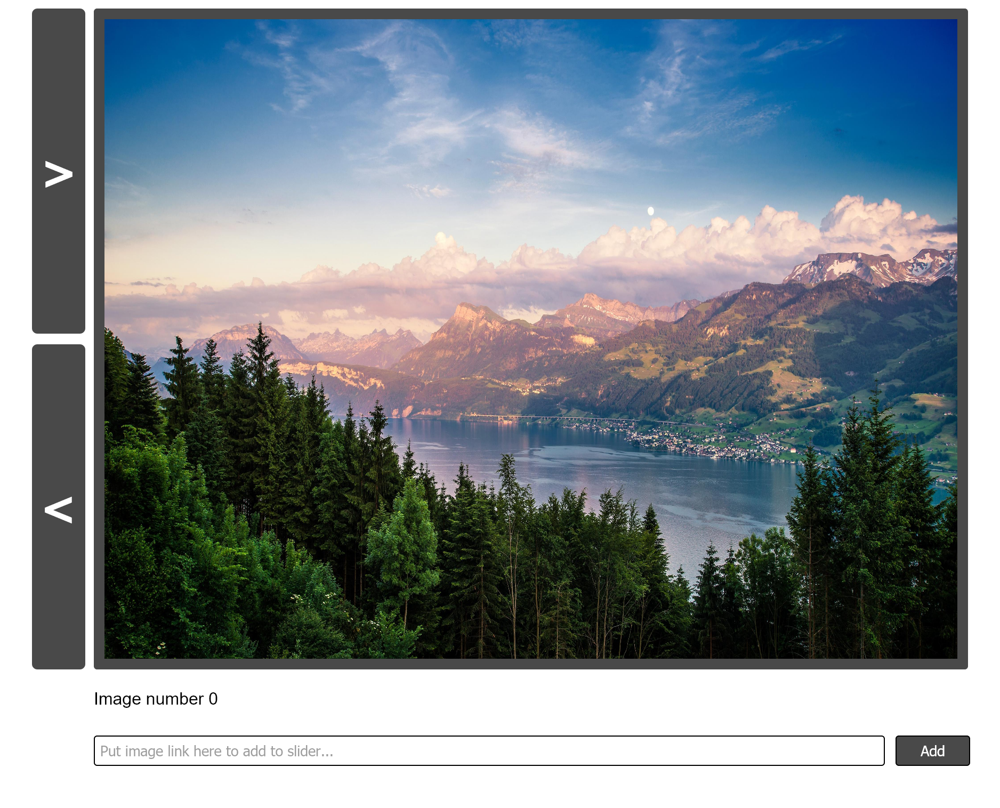

# js-background-image-slider
JS Challenge 6

Exercise 6 from the 100+ Javascript projects page (https://jsbeginners.com/javascript-projects-for-beginners/)

In this project i made a image slider, you press forward to show the next image, back to go to the previous one.
As bonus i also made it possible to add your own image to the slider (which is an array) with a text field in which you put your image URL.

